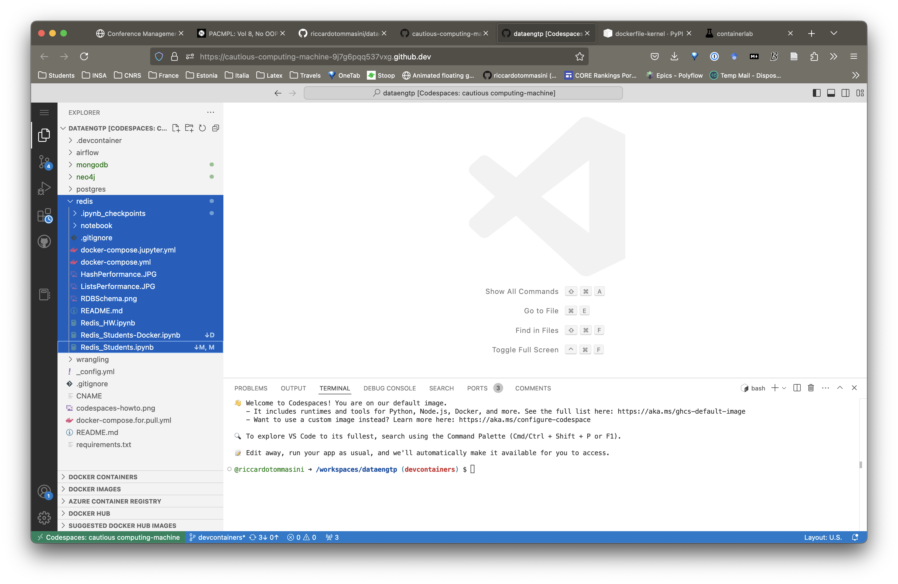

## Redis DB Practice

The practice works in Docker using Docker Compose.

You can run it either Locally (as we saw in the docker lecture) or with [Github Codespace](https://30daysof.github.io/data-science-day/week-2/1-codespaces/)

### Locally

- Pull the latest version of this repository
- cd into the redis folder
- run docker compose
  - you can use Visualstudio Code
  - you can use a dockerised installation of Jupyter
  - in the compose there is also a redis inight  client container to visualise the content of the database. Accessible locally on port 5540
  
### CodeSpace

Open Codespace as indicated in the images below (use the main branch).
And run docker in the codespace. From here on is the same as locally.




### Using Visual Studio

``` docker compose up -d ```

### Launchign with Jupyter Lab (in browser)

``` docker compose -f docker-compose.jupyter.yml up -d```

[Open Jupyter](http://127.0.0.1:8888/)


## Legacy

Here there are the instruction in case you would like to install redis locally without docker.

### PreLab

### 1. Install Redis on Windows
- Redis is a cross-platform DB, We can install it on Linux, or Windows, ..etc.
- There are two ways to install Redis under Windows
    - Download the latest Redis .msi file from https://github.com/MSOpenTech/redis/r... and install it. 
    
    - You can choose either from these sources:
        - [releases](https://github.com/microsoftarchive/redis/releases) or
        - [downloads](https://github.com/rgl/redis/downloads)

- Personally I prepared the first option
- Download Redis-x64-2.8.2104.zip
- Extract the zip to prepared directory
- run redis-server.exe
- then run redis-cli.exe
- For more info follow this setup-video [tutorial](https://www.youtube.com/watch?v=188Fy-oCw4w)


### 2. Linux and Debian 

- Even quicker and dirtier instructions for Debian-based Linux distributions are as follows:
    - download Redis from http://redis.io/download 
    - extract, run make && sudo make install
    - Then run sudo python -m easy_install redis hiredis (hiredis is an optional performance-improving C library).

### 3. Install the Python Package [redis](https://pypi.org/project/redis/) to connecto to Redis 
- use th command ```pip install redis``` in your command line.


### 4. Accessing Redis from Command Line:
- Add the Redis installation "/home" and "/bin" directories to the enviroment variables.
- start Redis server in one command window(CMD, poweshell, ..etc)using the command ```redis-server```.
- In anoher command window, start your Redis Client using the command ```redis-cli```
- Now you have the Redis Client Shell connected to the default <b>db0</b> DB. 

### Docker users

Simply clone the repository and run

```bash
docker-compose up
```

The following docker compose file will build the notebook container which includes all the required dependencies.
Services are also exposed to the host network so you can connect to the via localhost.

